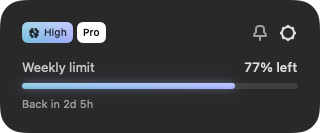
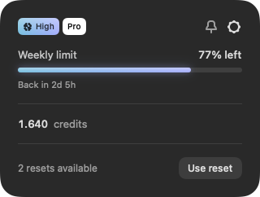
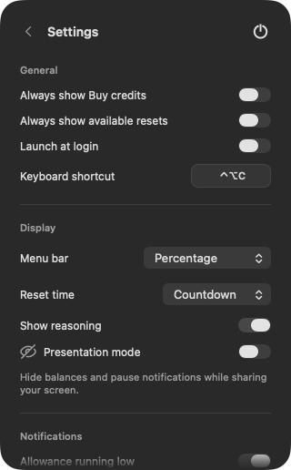
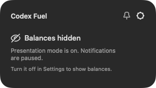
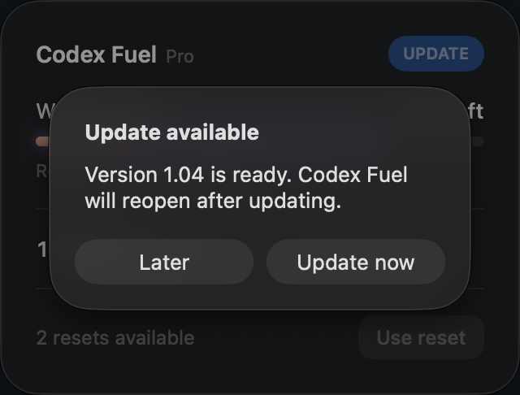

<p align="center">
  
</p>
<h1 align="center">Codex Fuel</h1>
<p align="center"><strong>Your Codex usage, a glance away.</strong></p>
<p align="center">Your Codex allowance, reset countdowns, and alerts in one quiet Mac app.</p>
<p align="center">
  <a href="https://github.com/fabianuix/codex-fuel-companion/releases/latest"><strong>↓ Download for Mac</strong></a>
  &nbsp; · &nbsp;
  <a href="#get-started">Getting started</a>
  &nbsp; · &nbsp;
  <a href="https://github.com/fabianuix/codex-fuel-companion/releases">What's new</a>
</p>
<p align="center"><sub>macOS 15 or later · Apple silicon and Intel · Lives in your menu bar</sub></p>

<br>

<p align="center">
  
</p>
<p align="center"><sub>Real app screens with sample data. Your layout adapts to the limits and credits on your account.</sub></p>

## Know where you stand

Click the menu-bar icon to see what's left and when your allowance returns. When your allowance runs out, your credit balance takes the spotlight. Available resets stay close by, too.

No extra Dock icon. Just a quiet place to check in, then get back to what you're building.

<p align="center">
  
</p>
<p align="center"><sub>Credits and available resets appear when your account provides them.</sub></p>


## Get started

1. **Sign in to Codex** or the Codex CLI on your Mac.
2. **[Download Codex Fuel](https://github.com/fabianuix/codex-fuel-companion/releases/latest)**, unzip it, and move the app to **Applications**.
3. **Open Codex Fuel.** Click its menu-bar icon, or press **Control + Option + C**.

That's it—Codex Fuel uses your existing Codex sign-in.

## Make it yours

- **Your menu bar, your choice.** Show the remaining percentage, time until reset, or just the icon.
- **Reset countdowns.** Keep the exact date and time, or switch to a live countdown.
- **A panel that stays nearby.** Pin it, drag it beside your work, and keep its saved position. Each launch starts unpinned. Right-click the menu-bar icon to return it to its original position.
- **Alerts at the right moment.** Choose 25%, 10%, both, or your own remaining-allowance threshold. Credit and reset notifications are available too.
- **Reasoning at a glance.** See the reasoning setting of your most recently used Codex task, with matching colors and a short hover explanation. You can hide this badge in Settings.
- **Quick access.** Set your own keyboard shortcut and choose whether the app launches at login.

<details>
<summary><strong>Take a look at Settings</strong></summary>
<br>
<p align="center">
  
</p>
</details>

## Share your screen comfortably

Turn on **Presentation mode** in Settings to hide balances in the panel and menu bar and silence usage alerts. Turn it off when you're ready to see your usage again.

<p align="center">
  
</p>

## Updates, without the fuss

When an update is ready, an **UPDATE** button appears in the app. Install it when you're ready, or check manually from Settings.

<p align="center">
  
</p>

See the [changelog](CHANGELOG.md) for a short list of changes in each release.

## Made to feel at home

Native Liquid Glass on macOS 26 and later, with a translucent panel on earlier supported versions. Refined badges and icons, soft blur behind tooltips and dialogs, smooth transitions, support for Reduce Motion, and your last known balance when you're offline.

Your preferences stay on your Mac. There's no extra account to create and no analytics service receiving your usage. Update checks contact GitHub for new versions and downloads.

## Explore the source

The latest released source is available in [Sources](Sources/CodexUsage), with
tests, build tools, and a [guide to building it](BUILDING.md).
[Download the current source snapshot](https://github.com/fabianuix/codex-fuel-companion/archive/refs/heads/main.zip).
See [SOURCE.json](SOURCE.json) for its version and file checksums.

This repository is updated only for intentional public releases or finished
documentation updates. The source is available for inspection; the existing
[license](LICENSE) remains in effect.

## Build the app yourself

You'll need **macOS 15 or later**, **Xcode command-line tools with Swift 6 or
later**, and **Python 3**. The first build needs an internet connection to
download the app's update framework.

**1. Install the tools.** If you haven't installed Apple's command-line tools,
open **Terminal** and run this, then finish the installation window:

```sh
xcode-select --install
```

**2. Get the source.** Run these commands in Terminal:

```sh
git clone https://github.com/fabianuix/codex-fuel-companion.git
cd codex-fuel-companion
```

**3. Build and open the app.** Keep Terminal in that folder and run:

```sh
export CODEX_FUEL_VERSION="$(python3 -c 'import json; print(json.load(open("SOURCE.json"))["version"])')"
./scripts/test.sh
./scripts/build.sh --dev
open "dist/Codex Fuel Dev.app"
```

The finished app is **Codex Fuel Dev.app** inside the **dist** folder. Look for
its icon in the menu bar; it doesn't open a normal window or appear in the Dock.
Sign in to Codex or the Codex CLI to see your account's usage.

This creates a separate development app with its own preferences. It won't
replace your installed release or install release updates. Quit the regular
Codex Fuel app while testing to avoid a keyboard-shortcut conflict. No paid
Apple Developer account or publishing credentials are needed for this local build.

Need help with the tools, ZIP downloads, or additional tests? See the
[full build guide](BUILDING.md).

---

**Have a question or found a rough edge?** [Open an issue](https://github.com/fabianuix/codex-fuel-companion/issues) and include your app and macOS versions. Please leave private account details out.

<p align="center"><sub>Made by <a href="https://github.com/fabianuix">Fabian</a> · An independent companion for Codex</sub></p>
