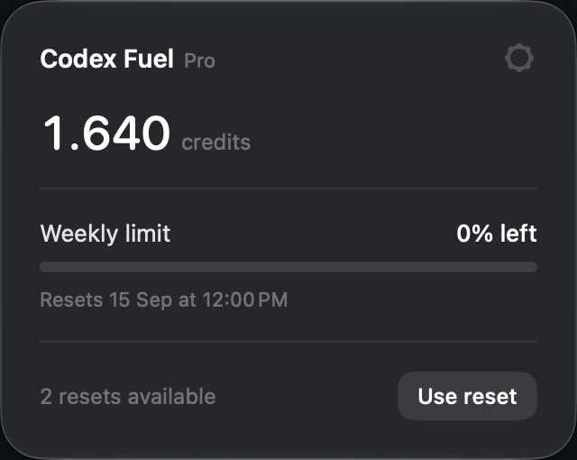

  

<h1 align="center">Codex Fuel</h1>

<strong>Your Codex usage, a glance away.</strong>

A small Mac app for keeping track of your allowance, credits, and next reset.

  <a href="https://github.com/fabianuix/codex-fuel-companion/releases/latest"><strong>↓ Download for Mac</strong></a>
  &nbsp; · &nbsp;
  <a href="#get-started">Getting started</a>
  &nbsp; · &nbsp;
  <a href="https://github.com/fabianuix/codex-fuel-companion/releases">What's new</a>

macOS 15 or later · Apple silicon and Intel · Lives in your menu bar

 

  

Real app screens with sample data. Your layout adapts to the limits and credits on your account.

## Know where you stand

Click the menu-bar icon to see what's left and when your allowance returns. When your allowance runs out, your credit balance takes the spotlight. Available resets stay close by, too.

No extra Dock icon. Just a quiet place to check in, then get back to what you're building.

  

## Get started

1. **Sign in to Codex** or the Codex CLI on your Mac.
2. **[Download Codex Fuel](https://github.com/fabianuix/codex-fuel-companion/releases/latest)**, unzip it, and move the app to **Applications**.
3. **Open Codex Fuel.** Click its menu-bar icon, or press **Control + Option + C**.

That's it—Codex Fuel uses your existing Codex sign-in.

## Make it yours

Open the gear icon to choose your keyboard shortcut, launch at login, and notification preferences. Get a heads-up when credits run low or your usage becomes available again.

<strong>Take a look at Settings</strong>

 

  

## Updates, without the fuss

When an update is ready, an **UPDATE** button appears in the app. Install it when you're ready, or check manually from Settings.

<strong>See how app updates work</strong>

 

  

Choose Update now. Codex Fuel downloads the update and reopens when it's ready.

## Made to feel at home

Native Liquid Glass on macOS 26 and later, with a translucent panel on earlier supported versions. Smooth transitions, support for Reduce Motion, and your last known balance when you're offline.

Your preferences stay on your Mac. There's no extra account to create and no analytics service receiving your usage. Update checks contact GitHub for new versions and downloads.

---

**Have a question or found a rough edge?** [Open an issue](https://github.com/fabianuix/codex-fuel-companion/issues) and include your app and macOS versions. Please leave private account details out.

Made by <a href="https://github.com/fabianuix">Fabian</a> · An independent companion for Codex

