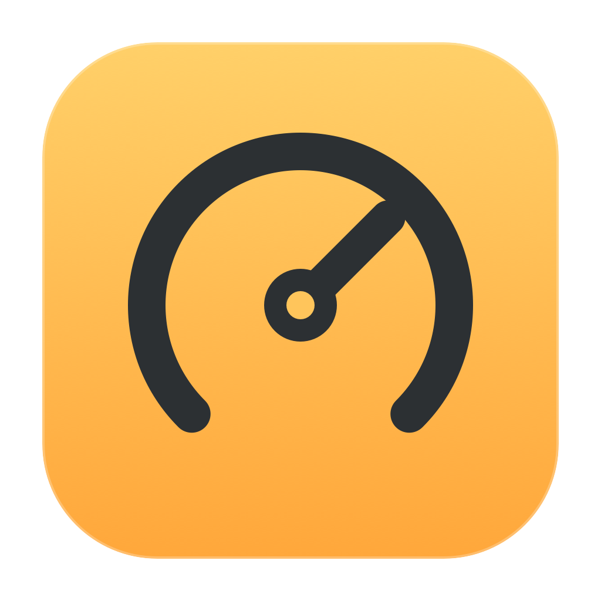

  

<h1 align="center">Codex Fuel</h1>

<strong>Your Codex companion for Mac.</strong>

Keep your allowance, credits, and resets a glance away.

  
  
  

  <a href="https://github.com/fabianuix/codex-fuel-companion/releases"><strong>Downloads & release notes</strong></a>
  &nbsp;·&nbsp;
  <a href="https://github.com/fabianuix/codex-fuel-companion/issues">Report an issue</a>

---

Codex Fuel is a lightweight native macOS app that keeps your Codex usage in the
menu bar. Check your remaining allowance, see your credit balance, and know when
your next reset arrives—all without breaking your flow.

## A little clarity, always within reach

| Feature | What it does |
| --- | --- |
| **Live usage at a glance** | See your remaining allowance in the menu bar and your next renewal in the panel. |
| **A clear credit balance** | Credits take the spotlight when your weekly allowance runs out. |
| **Resets within reach** | See available resets and use one directly from the app. |
| **Useful notifications** | Choose a low-credit alert and get notified when your allowance or resets return. |
| **Spending pace** | Add an estimate of how long your credits may last to the menu bar tooltip. |
| **Ready when you are** | Open the panel with **⌃⌥C**, or let Codex Fuel launch at login. |
| **Works through interruptions** | Keep your last known balance visible when the connection drops. |
| **Simple app updates** | Check for new versions in the background and install them from the app. |

## Made for your Mac

Native Liquid Glass on macOS 26 and later. A translucent panel on earlier
supported versions. Smooth balance transitions, support for Reduce Motion, and
no extra Dock icon.

## Get started

1. Install and sign in to Codex, or the Codex CLI, on your Mac.
2. Get Codex Fuel from **[Releases](https://github.com/fabianuix/codex-fuel-companion/releases)** and move it into **Applications**.
3. Open Codex Fuel and look for its icon in the menu bar.

Open the **…** menu to configure alerts, launch at login, and app updates.

## Your usage stays yours

Codex Fuel uses your existing local Codex sign-in. It does not read your
conversations or send usage data to an analytics service. Your preferences and
last known usage are stored on your Mac. Update checks contact GitHub to retrieve
version information and app downloads.

## Feedback

Found a bug or have an idea? **[Open an issue](https://github.com/fabianuix/codex-fuel-companion/issues)** with the app version and macOS version.
Please leave account details and other private information out of public reports.

---

An independent companion for Codex, made by <a href="https://github.com/fabianuix">Fabian</a>.

